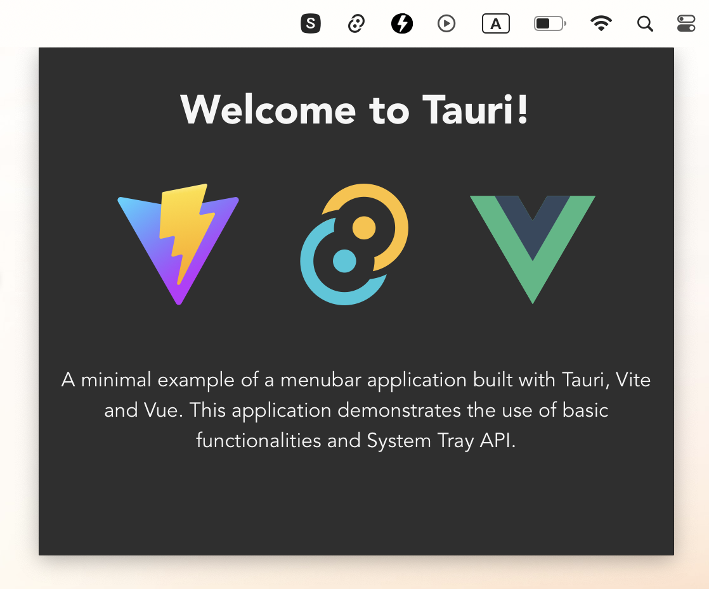

# Tauri Menubar

  

A minimal example of a menubar application built with [Tauri](https://tauri.app/). This application demonstrates the use of basic functionalities and System Tray API.

To learn more about how this application was built, check out the article [Creating a Menubar Application with Tauri](https://medium.com/@4gray/create-menubar-app-with-tauri-510ab7f7c43d).

## Running the application
To run the application, you need to have Tauri installed on your machine. You can find the installation instructions on the Tauri website.

    $ pnpm install 
    $ pnpm tauri dev

## Recommended IDE Setup

- [VS Code](https://code.visualstudio.com/) + [Volar](https://marketplace.visualstudio.com/items?itemName=Vue.volar) + [Tauri](https://marketplace.visualstudio.com/items?itemName=tauri-apps.tauri-vscode) + [rust-analyzer](https://marketplace.visualstudio.com/items?itemName=rust-lang.rust-analyzer)

## Contribute
If you would like to contribute to this project, please fork the repository and open a pull request with your changes.

## License
This project is licensed under the MIT License - see the LICENSE file for details

## Acknowledgements
Tauri Team for providing the framework
